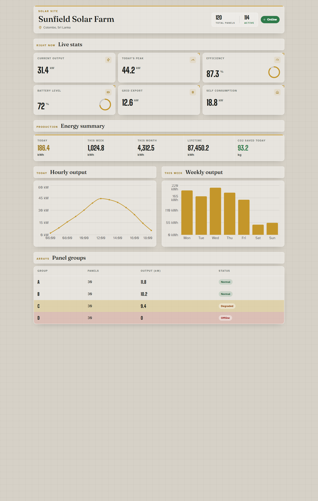

# Solar Dashboard

Intern task. Its a read only dashboard for Sunfield Solar Farm in Colombo.

I used React + Vite. No backend and no api calls. All the numbers come from `src/data/solarData.js` (the same data they sent).

## How to run

You need Node installed.

```
npm install
npm run dev
```

Then open the local url Vite prints. Usually its `http://localhost:5173`.

To make a production build:

```
npm run build
npm run preview
```

## Screenshot



## How its structured

Components are in `src/components`. I didnt dump everything in App.jsx. App.jsx just imports the data and passes it down as props.

Styling is Tailwind. Charts are Recharts.

## Whats in the page

- Site header (name, location, total panels, active panels, Online badge)
- Live stats cards
- Energy summary
- Hourly output chart
- Weekly output chart
- Panel group table (Offline in red, Degraded in yellow)

## Why I built it like this

I split the dashboard into separate components because putting the charts and the table into App.jsx would have made that file huge and hard to follow. Each component only gets the slice of data it needs as props, so if they change a number I just edit `solarData.js` and nothing else. For the panel table I map the status from the data to a CSS class, I didnt hardcode which row is red. I put the two charts side by side on desktop since they are both graphs and stacking them felt like wasted space.

Works on desktop and tablet.
